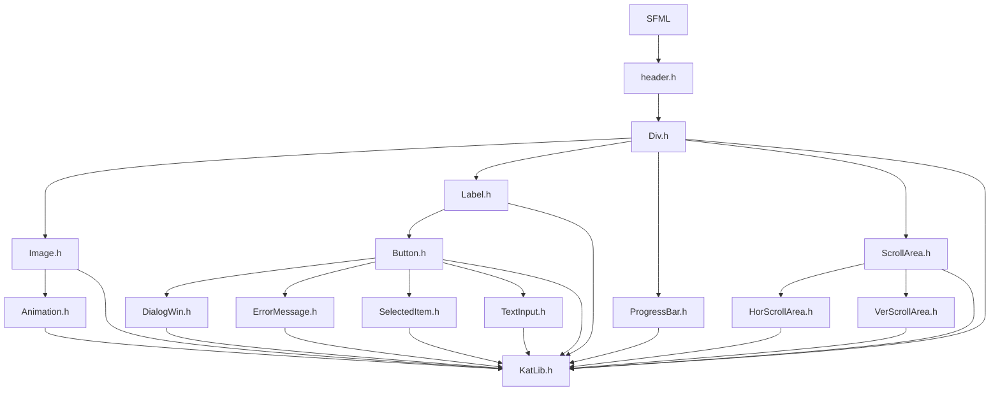

# Dependencies in KatLib

```mermaid
graph TB;
	SFML-->header.h
	header.h-->Div.h
	Image.h-->Animation.h
	Label.h-->Button.h
	Button.h-->DialogWin.h
	Button.h-->ErrorMessage.h
	Div.h-->Image.h
	Div.h-->Label.h
	Div.h-->ProgressBar.h
	Button.h-->SelectedItem.h
	Button.h-->TextInput.h
	Div.h-->ScrollArea.h
	ScrollArea.h-->HorScrollArea.h
	ScrollArea.h-->VerScrollArea.h
	Button.h-->KatLib.h
	DialogWin.h-->KatLib.h
	Div.h-->KatLib.h
	ErrorMessage.h-->KatLib.h
	Label.h-->KatLib.h
	SelectedItem.h-->KatLib.h	
	TextInput.h-->KatLib.h
	ScrollArea.h-->KatLib.h
	VerScrollArea.h-->KatLib.h
	HorScrollArea.h-->KatLib.h
	Image.h-->KatLib.h
	ProgressBar.h-->KatLib.h
	Animation.h-->KatLib.h
```
